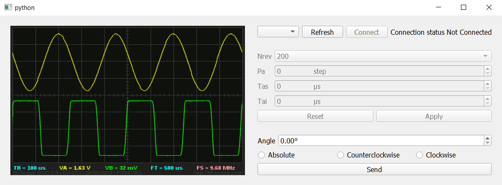

# TO DO LIST
-------
## TO DO
synthesizer max2871

### IMPORTANTE:

------------------------------------------------------------------------
### In Progress

- [ ] Start debe enviar el mensaje con la información de elevación y azimuth elegidas (para elevación se debe transformar lacantidad de veces según la *resolución escogiada* y *la cantidad de grados a moverse*)
- [ ] La rutina debe plotear para cada angulo de elevación

- [ ] Textbox con las frecuencias a utilizar (Ej, [200, 500, 1000             ])
- [ ] Elegir rango de grados de elevación (Ej: desde: -30º, hasta: 30º) Esto es mas complicado porque los angulos del motor steper son relativos, pero por mientras hay que dejar lista la caja sin funcionalidad en la GUI
y extraer las frecuencias procesando el string. Esto no debe hacer nada en un comienzo, quizás solo imprimir las frecuencias añadidas
- [ ] Agregar tooltips para nuevos widgets

- [ ] Agregar logica de segundo motor en codigo arduino (DIRPIN2)
------------------------------------------------------------------------
#### DONE
- [x] Dejar tooltips en un método para no desordenar la función principal
- [x] Crear Scroll area para widget derecho
- [x] Cambiar spinbox para que el default se setee automaticamente
- [x] Cambiar tamaño por defecto de las fuentes (con diccionario)
- [x] Agregar otro comando con un widget aparte que diga "start routine" o algo así, que envíe cierto comando que el arduino interprete como (se debe hacer otro case en el loop) que debe tomar las variables globales ya seteadas( resolución polar y de elvación) y hacer una rutina de movimientos desde ej -30 hasta 30 dando X vueltas por cada movimiento de elevación. Para simular esto con un solo motor, se podría hacer un delay al final de un movimiento polar, luego *moverse un step de ida y vuelta (para quedar donde mismo, que represente un movimiento de elevación)* y continuar con la siguiete vuelta
- [x] Corregir radio buttons: los de elevación deben ser independientes a los de azimuth
- [x] Agregar move y reset angle para elevación: deben por mientras imprimir por pantalla un mensaje similar al de azimuth
- [x] Agregar apply global que aplique todos los valores de una vez:
    - [x] Elegir resolución de elevación (la GUI solo debe enviar un comando, que por mientras se puede imprimir, ej: e-6400 (e->elevacion))
    - [x] se deben agregar estos parametros al Arduino
    - [x] se debe corregir el connect (para que tarde menos)
    - [x] Apply y Start deben ir fuera de la scroll bar

------------------------------------------------------------------------
### Extras
- [ ] Dejar grafico en decibeles
- [ ] Guardar datos en tarjeta SD

### Escritura/Lectura de archivos
- [ ] Agregar opción de escribir como JSON
- [ ] Agregar funcionalidad que permita leer un archivo CSV o JSON y plotear su contenido (en otra pestaña dentro de la misma GUI)

# Stepper Motor Controller

Python program with Graphic User Interface that allows communication via serial port with an Arduino Portenta board, which is used to control a stepper motor.

An image of the current state of the GUI is given below



# Useful commands
```
pyinstaller --onefile --noconsole --icon logo.ico centralWidget.py
```
