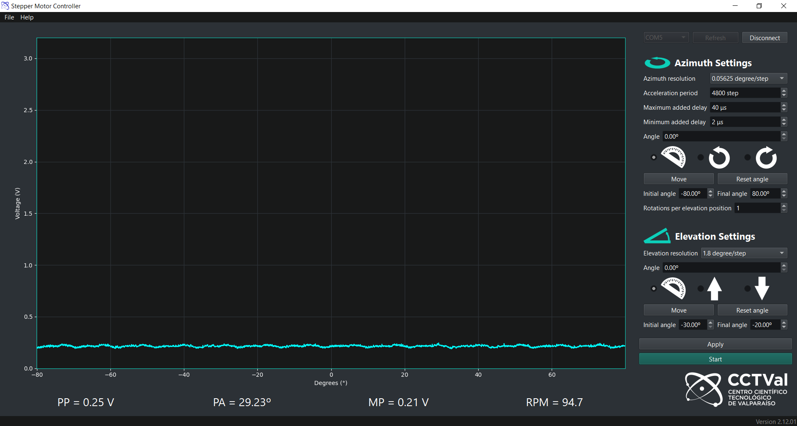

# TO DO LIST
-------
## TO DO

### Extras
- [ ] Migrar PyOne dark a PySide2

- [ ] Guardar datos en tarjeta SD

### Escritura de CSV/JSON
- [ ] Agregar opción de escribir como JSON
----------------------------------------------------------
### In Progress
- [x] corregir bug current position
- [x] corregir bug sentido positivo (left)(en plot se suma 1 que no es necesario)

- [x] corregir escalamiento en el plot (len(values))
- [x] Cambiar que cuando se conecte, se resetee el angulo cero

- [ ] Agregar información sobre plot (peak power, peak angle, mean power, RPM)
------------------------------------------------------------------------
#### DONE


# Stepper Motor Controller

Python program with Graphic User Interface that allows communication via serial port with an Arduino Portenta board, which is used to control a stepper motor.

An image of the current state of the GUI is given below



# Useful commands
```
pyinstaller --onefile --noconsole --icon logo.ico centralWidget.py
```
